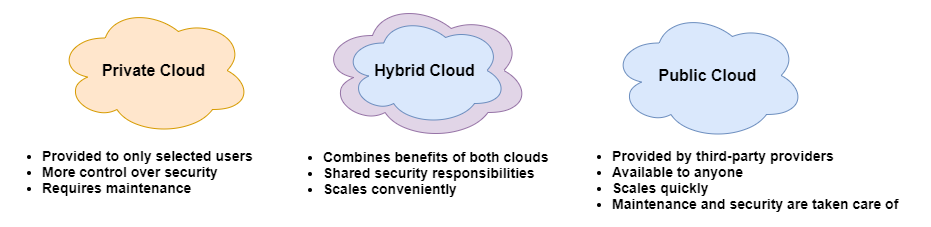
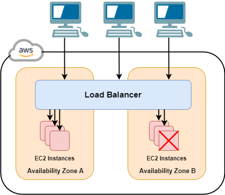
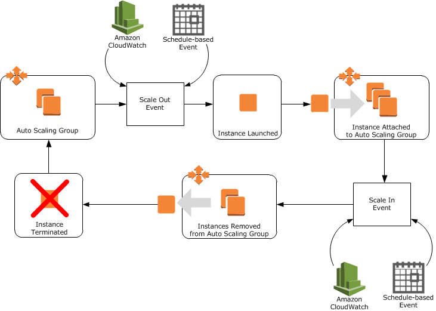

# Cloud Computing and AWS
## What is cloud computing and why should we use it?
Cloud computing is the delivery of computing services (servers, storage, databases, networking etc.) over the Internet (the cloud) to offer faster innovation, flexible resources, and economies of scale. Cloud services are normally pay-as-you-go, which helps lower operating costs, run the infrastructure more efficiently and can scale as the business changes. The cloud is a secure storage that protects your data from potential security threats as well as being reliable for disaster recovery.

## What is Amazon Web Services?
Amazon Web Services (AWS) is the world's most comprehensive and broadly adopted cloud platform, offering 200 fully features services from data centres globally. Companies (from start-ups to large enterprises and leading government agencies, so it's flexible) use AWS to lower costs, become more agile, and innovate faster.

### Why do Companies use AWS?
Compared to other cloud services providers:
* **Most functionality** - AWS provides more services, and more features within those services, than any other cloud provider. This makes it faster, easier and more cost effective to move existing applications to the cloud.
* **Most secure** - AWS is architected to be the most flexible and secure cloud computing environment. Their core infrastructure is built to satisfy the security requirements for the military, global banks, and other high-sensitivity organisations.

## Cloud types
* **On premises/Private cloud (local machine etc.)** - everything is stored locally. Companies on premise are responsible for the security of the data. If you lose the data, it's gone forever. 
* **Hybrid cloud** - Bridges the private cloud and public cloud. Sensitive information is kept in private cloud, everything else is stored in public cloud. Used by banks etc.

## Cloud scaling types
* **Autoscaling** - servers run based on the number of users. They scale up as more users use the service and scale down as less users use it.
* **Horizontal (Up)** - increase the size of the servers, or buying a larger server to accommodate the number of users.
* **Vertical (Out)** - increase number of servers, not good for maintenance costs.

## Architectures
### Monolithic
When all of the servers/instances are run from a single machine. Components of the program are interconnected and dependent on each other. If an update is made, the whole application has to re-run. Despite this, it's simpler to test than modular approaches (microservices), due to having fewer components as well as being simple to deploy. For example, running all vagrant virtual machines from a single Vagrantfile.

### Two tier
When the presentation layer (interface) runs on a client and a data layer/structure (database) gets stored on a server. Basically, when each instance is run on a separate machine. It separates these two components into different locations. Having separate layers can improve performance and scalability.

## Load Balancing
Load Balancing automatically distributes your incoming traffic across multiple targets, such as EC2 instances, containers, and IP addresses, in one or more Availability Zones. It monitors the health of its registered targets, and routes traffic only to the healthy targets.

### Application Load Balancer
* Operates at the request level, routing traffic to targets (EC2 instances, containers, IP addresses etc.) based on the content of the request
* Supports path-based routing and can route requests to one or more ports on each container instance cluster
* Ideal for handling HTTP and HTTPS traffic

### Network Load Balancer
* Operates at the connection level, routing connections to targets within the VPC, based on IP protocol data 
* Optimised to handle sudden and volatile traffic patterns while using a single static IP address per Availability Zone
* Ideal for handling TCP and SSL traffic.

### Classic Load Balancer
* Provides basic load balancing across multiple EC2 instances
* Operates at both the request (HTTP/HTTPS) and connection level (TCP/SSL)
* Intended for applications that are built within the EC2-Classic network.

### Load Balancer Diagram

## Auto Scaling
AWS Auto Scaling monitors your applications and automatically adjusts capacity to maintain steady, predictable performance at the lowest possible cost.

### Benefits
* **Maintain performance** - right-size multiple resources to meet application performance
* **Control costs** - automatically remove unneeded resources to avoid overspending
* **Simplify scaling** - scaling requires a few steps
* **Scale predictively** - past application metrics and scale resources ahead of time

### Auto Scaling Diagram

